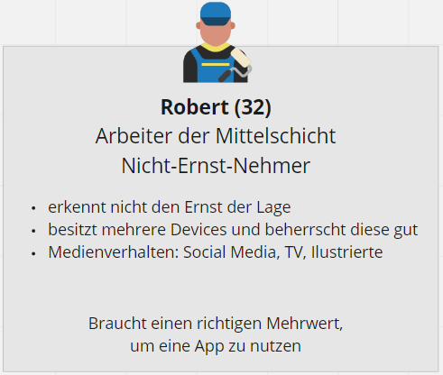
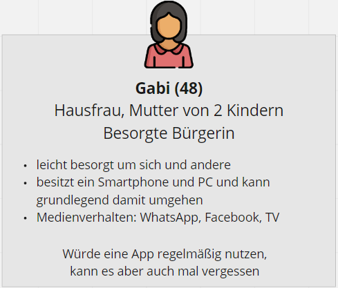
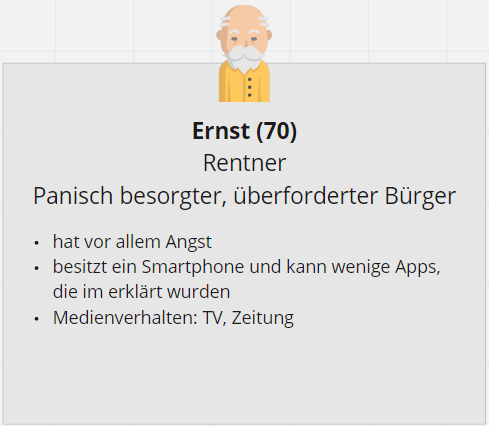
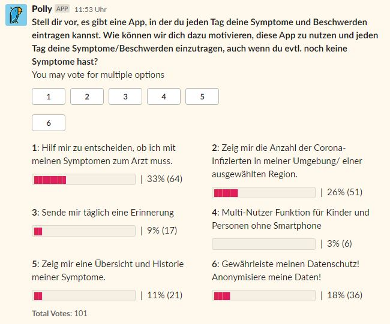
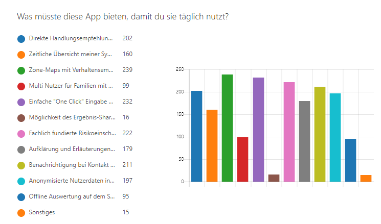
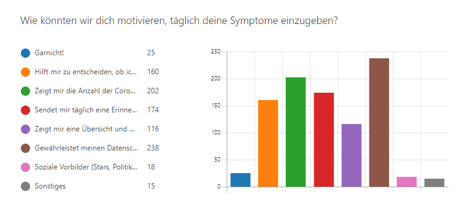

# Disease Pattern Early Recognition in Global Distribution!

<em>#WirVsVirus</em>

# Problembeschreibung
Viruserkrankungen sind Teil von unserem Leben. Jedes Jahr treten - vor allem in den Wintermonaten - 
"Erkrankungen durch saisonal zirkulierende, humane Influenzaviren"[1] auf. Dies erfolgt durch die Mutation der Viren, welche aber prognostiziert und daher gut therapiert werden können. 

Im Vergleich dazu gibt es Viren, "gegen [die] es in der Bevölkerung keine oder nur in einem kleinen Anteil der Bevölkerung eine vorbestehende Immunität gibt, [die] humanpathogen [sind] und [die] sich leicht von Mensch zu Mensch [verbreiten]" [1]. Der SARS-CoV-2 zählt zu diesen Viren. 

Durch eine immer engere Vernetzung der Menschen sowohl im Gesellschaftlichem, wie im Wirtschaftlichem als auch länder- und kontinentenübergreifend, ist die Ausbreitungsgeschwindigkeit für solche Viren deutlich gestiegen. Kommen dann noch lange Inkubationszeiten und unterschiedliche Krankheitsverläufe, wie bei Covid-19 dazu, wird auch die Ermittlung von Infektionsketten sowie die Vorhersage zukünftiger Hotspots von Infizierten erschwert. Aus diesen Gründen kann es schnell von einer Epidemie zu einer weltweiten Pandemie kommen. Dies steigert die Angst in der Bevölkerung, sich selber zu infizieren. 

Zusammengefasst sind die Hauptprobleme:

1. Eigenschaften der Viren zu Beginn des Auftretens unbekannt
2. Krankheitsverlauf unbekannt und unterschiedlich
3. Keine passende Therapie
4. Kein Impfstoff zur Verfügung
5. Ausbreitungsgeschwindigkeit sehr hoch
6. Ermittlung von Infizierten und Infektionsketten schwierig
7. Vorhersage von entstehenden Hotspots von Infizierten nicht gegeben
8. Steigende Angst in der Bevölkerung

Dies hat unter anderem zur Folge, dass Ärzte häufiger aufgesucht werden, eine hohe Dunkelziffer von Infizierten vorliegt und das gerade über milde Verläufe wenig bis keine Kenntnisse möglich sind. Dies zusammen hat dann meistens zur Folge, dass vor allem die öffentlichen und medizinischen Gesundheitssysteme an ihre Kapazitäten stoßen. Um dem entgegen zu wirken, müssen Lösungen für die verschiedenen Probleme entwickelt werden. 

[1] Nationaler Pandemieplan Teil II. "Wissenschaftliche Grundlagen." Robert Koch-Institut, März 2017.

# Lösung
Im Rahmen des Hackathons haben wir eine Lösung entwickelt, die die Probleme 2, 6, 7 und 8 aus der Problembeschreibung adressiert. Hierfür haben wir ein App-Konzept sowie eine prototypische Umsetzung entwickelt. Die App soll 

- Daten, wie Symptomausprägung und Positionsdaten, vom Nutzer entgegennehmen,
- diese mit [TODO: Wording] Algorithmen verarbeiten,
- die Ergebnisse dem Nutzer in einfacher und verständlicher Weise anzeigen sowie
- Schnittstellen für andere Datennutzer (z. B. Regierung, medizinische Forschung) zur Verfügung stellen.

Auf dem Weg zur Entwicklung des Click-Dummies und der technischen Umsetzung waren mehrere Schritte notwendig. Als erstes haben wir die Zielgruppe unserer App definiert. Schnell war klar, dass wir mit der App alle Bürgerinnen und Bürger Deutschlands erreichen wollen. Denn je mehr Menschen ihre Symptom- und Positionsdaten, desto größer ist die Datengrundlage und desto genauer ist die Auswertung und damit der Schutz aller. Um bei der Entwicklung aber ein konkretes Bild unserer Zielgruppe vor Augen zu haben, haben wir 4 Personas entwickelt, die prototypische Vertreter der Zielgruppe darstellen. Parallel haben wir zwei Umfragen aufgesetzt, in denen wir nach Nutzungsmotiven für die App gefragt haben, und nach bereits existierenden Lösungen recherchiert. Aus den Ergebnissen der Personas, Umfragen und der Recherche haben wir schließlich Funktionen definiert, die die App enthalten sollte. Die Recherche der bereits existierenden Lösungen ergab, dass diese Lösungen weder alle oben genannten Probleme addressieren noch unsere definierten Funktionen voll umfassen. Das unterstützte uns in der Entscheidung ein eigenes App-Konzept zu erstellen, umzusetzen und zu implementieren. So entstanden ein Click-Dummy sowie eine prototypische Implementierung, auf denen im Anschluss an den Hackathon weiter aufgebaut werden soll. 

# Ergebnisse

## Personas

In einem ersten Schritt wurden die Zielgruppen unserer App definiert: die allgemeine Bevölkerung, öffentliche Einrichtungen undd medizinische Einrichtungen. Es wurde sich auf die Gruppe Bevölkerung fokussiert, da diese Gruppe die App später nutzen soll. Die anderen beiden Zielgruppen benötigen die Eingabe und treten daher zunächst in den Hintergrund. Bei der Bevölkerung wurde eine weitere Unterscheidung bezüglich dem Gesundheitszustand getroffen: Gesunde Person, Person mit Vorerkrankungen aber symptomfrei und Person mit Symptomen. Hierbei waren die ersten beiden von besonderem Interesse, da diese von einer Nutzung der App überzeugt werden müssen. Aus diesem Grund wurde für diese Gruppen Peronas definiert. Insgesamt konnten vier verschiedene Personas erstellt werden. 

### Robert

Die erste Person ist Robert, 32 Jahre und Arbeiter in der Mittelschicht. Er ist derzeit gesund, hat keine Vorerkrankungen und erkennt nicht den Ernst der Lage. Er besitzt mehrere digitale Geräte und beherrscht diese gut. Er nutzt verschiedenste Medien zum Informieren und Austauschen mit anderen. Da er derzeit gesund ist und den Ernst der Lage nicht erkennt, muss eine App für ihn einen richtigen Mehrwert bieten, damit er diese nutzt. 

### Gabi

Die zweite Person ist Gabi, 48 Jahre, Hausfrau und hat zwei Kinder. Sie ist derzeit gesund, hat keine Vorerkrankungen ist aber leicht besorgt um sich und ihre Kinder. Sie besitzt ein Smartphone und einen PC und kann mit beiden grundlegend umgehen. Sie nutzt verschiedenste Medien zum Informieren und zum Austauschen, wobei sie sich hierbei auf die bekanntesten beschränkt. Sie würde eine angebotene App regelmäßig für sich und ihre Kinder nutzen. Da sie aber viel hat, kann es vorkommen, dass sie die Nutzung auch mal vergisst.

### Ernst

Die dritte Person ist Ernst, 70 Jahre und Rentner. Er ist derzeit gesund, hat aber bereits Vorerkrankungen und ist daher panisch besorgt um seine Gesundheit. Aufgrund seines hohen Alters besitzt er zwar ein Smartphone kann dies aber nur für einfache Anwendungen nutzen. Nachdem die Kinder ihm gezeigt haben, wie eine Anwendung funktioniert, kann er diese auch nutzen. Er informiert sich vorallem im öffentlich, rechtlichen Fernsehen sowie in Printmedien. Er würde, sofern er die App verstanden hat, diese mehrmals täglich nutzen, um stets sein Gewissen zu beruhigen. 

### Anna

Die letzte Person ist Anna, 20 Jahre und Studentin. Sie ist gesund und hat keine Vorerkrankungen. Spaß steht bei ihr im absoluten Fokus, sie macht sich aus allem einen Spaß und provoziert gerne. Sie gehört zur Generation digital native und informiert sich daher fast ausschließlich über Social Media. Sie würden den Sinn der App nicht verstehen und sich einen Spaß daraus machen, die App mit falschen Eingaben zu nutzen. 

## Umfragen und Ermittlung der Herausforderungen

Die App liefert nur dann eine ausreichende Datengrundlage, wenn eine Vielzahl an Menschen diese regelmäßig nutzt. Deshalb ist es wichtig, im Vorfeld die Nutzerbedürfnisse zu ermitteln. Aus diesem Grund haben wir eine Umfrage erstellt, um herauszufinden, welchen Funktionsumfang die App haben muss und welchen Mehrwert sie für eine tägliche Nutzung bieten muss. Wir haben die Umfrage sowohl im Slack-Channel des Hackathons als auch über unsere Kanäle verteilt. Insgesamt haben 451 Personen an der Umfrage teilgenommen, 101 Personen im Slack-Channel und 350 an der öffentlich verteilten Umfrage.

Die Ergebnisse der Slack-Umfrage sind in Abbildung 1 dargestellt. Es ist klar zu erkennen, dass den Nutzern vor allem die Diagnose der Symptome, die Darstellung von Regionen mit der Infiziertenanzahl sowie die Gewährleistung des Datenschutz wichtig sind. Auch die öffentlich verteilte Umfrage (siehe Abbildung 2 und 3) zeigt die gleichen Ergebnisse. Da hier noch weitere Möglichkeiten abgefragt wurden, konnten weitere Funktionen die einem Nutzer wichtig sind ermittelt werden. Neben den oben genannten Funktionen ist den Nutzern die Usability, die fachlich fundierte Risikoeinschätzung sowie eine Benachrichtigung bei Kontakt mit Infizierten wichtig. Zusätzlich wurde in der Umfrage noch gefragt, wie man die Nutzer zur täglichen Eingabe der Symptome motivieren kann. Hierbei ist den Nutzern der Datenschutz am wichtigsten gefolgt von der Darstellung der Infiziertenanzahl in einer Region. 

Die Nutzer konnten am Ende der Umfrage noch mitteilen, was ihnen zusätzlich wichtig bei der Nutzung einer solchen App ist. Hierbei gab es insgesamt 89 Antworten mit Häufungen in den Themenfeldern Datenschutz (26 Nennungen), Keine Panikmache/Verunsicherung (10 Nennungen), Verwendung seriöser Quellen/ Empfohlen von öffentlichen Stellen (10 Nennungen) und einfache Benutzeroberfläche/Bedienung (8 Nennungen).

Zusammengefasst konnten 13 Leitfragen in drei Hauptgruppen ermittelt werden, die von einer App positiv beantwortet werden müssen, damit diese flächendeckend genutzt wird:

- Akzeptanz in der Gesellschaft
	- Wird der Datenschutz sichergestellt?
	- Ist die Seriosität gewährleistet?
	- Wurde eine mögliche Verunsicherung der Bevölkerung aufgrund der Ergebnisdarstellung berücksichtigt?
- Nutzung der App
	- Wie kann sichergestellt werden, dass die App regelmäßig genutzt wird?
	- Wie kann sichergestellt werden, dass jeder Bürger (auch gesunde) die App nutzen?
	- Wie kann sichergestellt werden, dass keine absichtlich falschen Eingaben getätigt werden?
- Technische Umsetzung
	- Gibt es Möglichkeiten der Symptomerfassung?
	- Gibt es Möglichkeiten der Standorterfassung?
	- Gibt es Algorithmen zur Ermittlung von Infektionsketten?
	- Gibt es Algorithmen zur Vorhersage von Hotspots von Infizierten?
	- Gibt es Algorithmen zur Einschätzung der Symptome?
	- Gibt es Konzepte zur Erweiterung?
	- Gibt es Möglichkeiten zur Einbindung in andere Systeme?

<em>Abbildung 1: Slack-Umfrage</em>

<em>Abbildung 2 Öffentliche Umfrage Teil I</em>

<em>Abbildung 3 Öffentliche Umfrage Teil II</em>

## Analyse exisiterender Lösungen

Die Idee zum **#WirVsVirus** Hackathon der deutschen Bundesregierung entstand aus dem am vorigen Wochenende in Estland erfolgreich veranstalteten Hackathon. Unter den Einreichungen waren, neben einer App für die Einrichtung von täglichen Routinen, auch zahlreiche Vorschläge über Apps zum Tracking und zur Selbstdiagnose. 
[t3n: Bundesregierung startet Hackathon](https://t3n.de/news/bundesregierung-wirvsvirus-1263682/ "t3n digital pioneers")

Mit 54 Teams ist in Deutschland **Corona Tracking** das mit Abstand am meisten bearbeitete Thema. Es gibt bereits multiple Lösungen und auch das Robert Koch Institut beschreibt in  ihrem [Pandemieplan]([https://www.rki.de/DE/Content/InfAZ/I/Influenza/Pandemieplanung/Downloads/Pandemieplan_Teil_II_gesamt.pdf?__blob=publicationFile](https://www.rki.de/DE/Content/InfAZ/I/Influenza/Pandemieplanung/Downloads/Pandemieplan_Teil_II_gesamt.pdf?__blob=publicationFile)) ein Surveillancesystem : 
> Surveillancesysteme dienen der systematischen, kontinuierlichen Erhebung, Zusammenstellung, Analyse und Bewertung von Daten sowie der zeitnahen, kontinuierlichen Berichterstattung der Ergebnisse. Bei der Etablierung von Influenzasurveillancesystemen sind die Repräsentativität der Datenquellen, das Erheben von Daten für die verschiedenen Schweregrade der Erkrankung und das Erfassen von Bezugsgrößen wichtige Qualitätskriterien. Für die Bewertung von Surveillancedaten in einer Influenzapandemie sind historische saisonale Daten zum Vergleich notwendig.

Dabei sieht das RKI ethische, sowie datenschutzrelevante Herausforderungen beim Erzeugen und im Umgang mit den Gesundheits- und Positionsdaten. Sie gehen davon aus, dass mathematische Modelle bei der Auswertung eine große Rolle spielen werden, die Qualität aber von der Datengrundlage abhängt. Auf Basis der Datenlage sollen differenzierte Lagebeurteilungen der Situation in Deutschland möglich sein. 

Im Folgenden sollen bestehende und veröffentlichte Lösungen unter drei Gesichtspunkten verglichen werden. Die Funktion steht im Mittelpunkt der Betrachtung. Die Nutzerfreundlichkeit und der Datenschutz sind darüberhinaus zwei weitere Aspekte, die den Erfolg und die Akzeptanz der Bürger maßgeblich beeinflussen. 

Gesundheitsassistentinnen wie [AVA](https://ada.com/de/) oder [Vivy](https://www.vivy.com/) beraten die Bürger bereits seit längerem zu ihrer Gesundheit. Es können Gesundheitsdaten eingegeben werden und von Symptomen mögliche Diagnosen abgeleitet werde. Doch dabei geben Benutzer sehr private Informationen kund. Wegen mangelndem Datenschutz standen die beiden Services in der Vergangenheit immer wieder in der [Kritik]([https://www.aerzteblatt.de/nachrichten/106679/Gesundheits-App-Ada-wegen-Datenschutz-in-der-Kritik](https://www.aerzteblatt.de/nachrichten/106679/Gesundheits-App-Ada-wegen-Datenschutz-in-der-Kritik)). 

Ganz ähnlich funktioniert eine der bekannteste Corona-Applikation in Deutschland, die [CovApp](https://www.charite.de/forschung/forschung_aktuell/pressemitteilung/artikel/detail/coronavirus_charite_startet_corona_app_covapp/) der Charité Berlin. 

>Mit der CovApp und dem dahinterstehenden Fragebogen bekommen Berlinerinnen und Berliner bereits zu Hause eine Entscheidungshilfe, ob sie die Untersuchungsstelle aufsuchen sollten und ob ein COVID-19-Test sinnvoll ist. [...] Darüber hinaus gibt die CovApp Informationen, wie sich das eigene Infektionsrisiko reduzieren lässt.

Da die Charité eine sehr anerkannte medizinische Institution ist, bekommen die Ergebnisse des Tests und die Handlungsempfehlungen große Glaubwürdigkeit. Der sachliche und schlichte Aufbau der App trägt dazu bei. Besorgte Bürger bekommen eine fundierte Aussage über eine mögliche Infektion und werden gegebenenfalls  beruhigt. Die App trägt bedeutend zu der Reduzierung des Ansturms auf Ärzte und Krankenhäuser bei. Nur einzelnen Fällen wird geraten mit einer Zusammenfassung des Test sich an medizinisches Personal zu wenden. 
Allerdings werden vermutlich keine weiteren Informationen über die Teilnehmer des Tests ausgewertet, gespeichert oder weiterverarbeitet. Personen denen geraten wurde einen Arzt aufzusuchen, könnten die ärztliche Diagnose zurück in die App geben und somit den Algorithmus verbessern. Die systematische und regelmäßige Abfrage der Symptome einzelner Personen und der Veränderung über die Zeit, könnte dazu führen die Krankheit und ihr auftreten besser zu verstehen. Die Verknüpfung der Testeingaben mit Positionsdaten könnte Aufschluss darüber ermöglichen in welcher Region Bürger vermehrt Symptome erleiden und ob es sich um ein Risikogebiet handelt. Durch weitere Darstellungen und Informationen in der App könnte die Sorge der Bevölkerung gelindert werden und viele Informationen an einem Ort zur Verfügung gestellt werden. 

Der [Corona Detector](https://coronadetector.com/) ist eine Anwendung, die von Studenten entwickelt worden ist. Diese soll nach Beantwortung eines kurzen Fragebogens eine Orientierung anhand von Empfehlungen der WHO geben. Die Anwendung ist grafisch schön aufbereitet und biete eine einfache Bedienung. Im Gegensatz zu der Charité App fehlt leider eine offizielle Institution, die Glaubwürdigkeit vermittelt. Die Anwendung vermittelt nicht den Anschein, dass die Daten weiterverarbeitet und ausgewertet werden, deshalb ist Datenschutz keine Hürde. 

Das [Faster than Corona](https://www.fasterthancorona.de/#questionnaire) Team erhebt auch Daten über Symptome. 
>Teilen Sie uns mit, wie es Ihnen geht, oder ob sie schon einen Corona-Test gemacht haben. Daten spenden kann jeder, egal ob krank oder gesund. Mithilfe einer Künstlichen Intelligenz wollen wir nach Mustern in den Daten suchen und so auf medizinische Zusammenhänge stoßen, die bisher verborgen blieben 

Durch eine wirklich kurze Checkliste ist die Bedienbarkeit einfach. Darüber hinaus ist die Seite mit nützlichen, zusätzlichen Informationen, wie einer Infektionskarte und einem FAQ über Corona gefüllt. Damit erhöht die Seite ihren Informationsgehalt und die Attraktivität. 

Einen anderen Ansatz verfolgen die Wissenschaftler hinter der [Geohealth App](https://www.geohealthapp.de/). 
>Die grundlegende Funktion beruht darauf, dass die Location Histories von Indexpatienten (Corona-positive Mitbürger) mit denen von potenziellen Kontaktpersonen abgeglichen werden können. Ein Risikomodell berechnet dann aus Faktoren wie Entfernung der Personen zueinander und Dauer des Kontakts das mögliche Infektionsrisiko.

Ein entscheidender Faktor im Kampf gegen die Verbreitung der Pandemie ist die Nachvollziehbarkeit von Infektionsketten und Definition von Risikogebieten.  Mit Hilfe der App können diese Informationen besser erhoben werden. Die Daten müssen zum jetzigen Zeitpunkt von der infizierten Personen gespendet werden. Das setzt eine hohe Interaktionsfreudigkeit mit der Anwendung und eine breite Akzeptanz voraus, um einen sinnvollen Effekt zu erzielen. Dieses wird von den Machern als digitale Impfung bezeichnet, wenn nur ca. 3% der Bevölkerung mitmachen, zeige es keine Wirkung. Lediglich mit der Mehrheit der Daten von Indexpersonen kann eine flächendeckende Funktion gewährleistet werden. Die Umfrage von Heise und weitere von unserer Gruppe durchgeführte Umfrage zeigen eine generelle Bereitschaft der Bürger ihre Daten zur Verfügung zu stellen. 

Einerseits können sich die Mitbürger darüber Informationen einholen, ob bei Ihnen innerhalb der letzten Tage ein Kontakt zu einem positiven Mitbürger bestand, um so beispielsweise grippale Symptome besser einzuschätzen. Andererseits können sich die Benutzer der App an einer Übersichtskarte orientieren, wie viele Menschen in Ihrer näheren Umgebung infiziert wurden.

Doch dabei gibt es große Bedenken! Wie auch bei den medizinischen Daten, geben GPS-Daten einen großen Aufschluss über Individuen und sind besonders stark zu schützen. Dadurch ergeben sich Herausforderungen mit dem Datenschutz. 

Datenschutz ist vor allem in der westlichen Welt eine wichtige Angelegenheit.
Das Vorgehen und die Methoden der Behörden in Chinas und Südkoreas unterscheiden sich davon grundlegend.
Südkorea hat eine Handyapp an seine Bürger ausgerollt, die anhand von GPS Daten kontrolliert, ob sie die verordnete Quarantäne einhalten. Gegebenenfalls wird ein Verstoß an zuständige Beamte gemeldet. Die App kann auch dazu genutzt werden Symptome und den Krankheitsverlauf an die zuständigen Beamten weiterzugeben.  Diese Beispiel zeigt, dass es technisch möglich ist diese Funktionen umzusetzen. 

Damit die Bürger nicht ein Gefühl von Überwachung und Machtlosigkeit bekommen, ist die Art und Weise mit derart persönlichen Daten umzugehen essentiell. Zum Schutz der Daten haben Forscher am MIT eine neue Technologie entwickelt mit Geodaten umzugehen. 

Die [Private Kit](http://privatekit.mit.edu/)  Entwickler beschreiben in einem [Whitepaper]([https://arxiv.org/pdf/2003.08567.pdf](https://arxiv.org/pdf/2003.08567.pdf)) die Entwickler die Herausforderungen und die technische Umsetzung.  
>We seek to outline the different technological approaches to mobile-phone based contact-tracing to date and elaborate on the opportunities and the risks that these technologies pose to individuals and societies. We describe advanced security enhancing approaches that can mitigate these risks and describe trade-offs one must make when developing and deploying any mass contact-tracing technology

Sie entwickelten einen Algorithmus bei dem Bewegungsprofile erstellt werden, die Daten allerdings nie das Gerät des Benutzers verlassen. Diese Lösung stellen sie *Open Source* zur Verfügung. 
Das Onlinemedium Wired hat dazu einen sehr differenzierten [Artikel](www.wired.com/story/phones-track-spread-covid19-good-idea/) geschrieben, der sowohl Vor- als auch Nachteile beleuchtet. 
Diese Technologie könnte die Akzeptanz der Bürger erhöhen, wenn diese verstehen, dass die verwendeten Daten sicher sind. Denn bei der Verwendung ist es essentiell, dass viele Individuen teilnehmen um eine fundierte Datenbasis zu bekommen.
Allerdings gibt es auch Beschränkungen der verwendeten Daten. Neuste [Studien](https://journals.plos.org/plosone/article?id=10.1371/journal.pone.0219890)  belegen, dass mobile GPS Daten nur eine Genauigkeit zwischen 7-13 Metern haben. Da sich das Corona Virus nur in einem Bereich bis 2 Metern übertragt, kann keine hunderprozentige Aussage darüber getroffen werden, ob zwei Personen wirklich in diesem Bereich waren. Trotzdem ermöglichen diese Daten eine gute Grundlage, gerade wenn Personen sich länger an einem Ort aufgehalten haben oder zusammen eine Strecke zurücklegen. 

### Fazit:
Wie man an diesem kurzen Überblick an bestehenden Anwendungen sehen kann, gibt es bereits eine Vielzahl innovativer Lösungen. In ihrem jeweiligen Bereich bieten sie einen großen Mehrwert für die Funktion für welche sie erstellt wurden. 
Da es bei einer Pandemie allerdings auf eine überregionale, nationale, sogar internationale Betrachtung ankommt, müssen große Datenmengen erzeugt werden. Dafür muss man einen großen Pool an Individuen von der Nutzung der jeweiligen App überzeugen. 
Deshalb ist es sinnvoll die verschiedenen Funktionen in einer Anwendung zu vereinen. Dadurch kann man medizinische mit geographischen Daten in Verbindung setzen, die Daten für die Forschung, die Behörden und die Bürger verwenden. 

## Definition der Funktionen

## Data Analysis Algorithm

## Architektur

## Click-Dummy

Zur besseren Darstellung und zum Test der Software wurde ein Click-Dummy erstellt. Der Click-Dummy wurde auf der professionellen Software Adobe XD aufgesetzt. Der Funktionsumfang wurde anhand der Umfrage und dem Vergleich mit anderen Apps erstellt.

Dargestellt im Mockup:
- Ersteinrichtung
- Tageseingabe
- Handlungsempfehlung
- Zone-Maps 
- Daily Push-Benachrichtigung
- Sharing-Funktion
Der Mockup ist online abrufbar unter: https://xd.adobe.com/view/130f088c-c69f-434f-7976-110ea7221138-653e/?fullscreen

Basierend auf dem ersten Entwurf sollte weitergearbeitet werden, um eine vollumfängliche App mit einem guten User Interface und einer guten User Expirience zu erhalten.

## Implementierung

# Team Introduction

Wir sind ein bunt gemischtes Team, zu Beginn alles Mitglieder/Freunde des Netzwerks der Studenten und Jungingenieure des VDI (Verein Deutscher Ingenieure).
Im weiteren Verlauf des Hackathons haben wir uns mit Experteninnen und Experten verschiedener Fachrichtungen ausgetauscht und ergänzt. 

Unser Team:

**System Development / Hacking** Architecture / Development of a scalable micro-service oriented architecture 

- Andreas Stutz (Architecture, Deployment, )
- Benedikt Geib (REST-API / Mobile App)
- Janik Ritz (Data Persistance)
- Melanie Wassmer (Mobile App)
- Philipp Gesner (Data Analysis)
- Marwin Madsen (Mobile App)

**Scientific Research**
- Kathrin Korte (Data Analysis Algorithm)
- Johanna Hoppe 
- Charlotte Maschke

**Public Research**
- Luisa Miny (User Experience)
- Torben Deppe (Research Communication)
- David Seck (???)
- Vincent Laux (MockUp / Usability)
- Riadh Dhaoui (Video Design)
- Jonas Thees (???)

# List of Repositories

**Cloud Application**
https://github.com/stan1025/WirVsVirus

Special Thanks to Amazon Web Service especially to Pawel Warmuth for supporting with a billing voucher as well as the great support!

**Mobile Application**
https://github.com/stan1025/WirVsVirus_App

Follow the link and find more information about our idea: ["Disease-pattern-early-recognition-in-global-distribution"](https://devpost.com/software/disease-pattern-early-recognition-in-global-distribution#updates)
