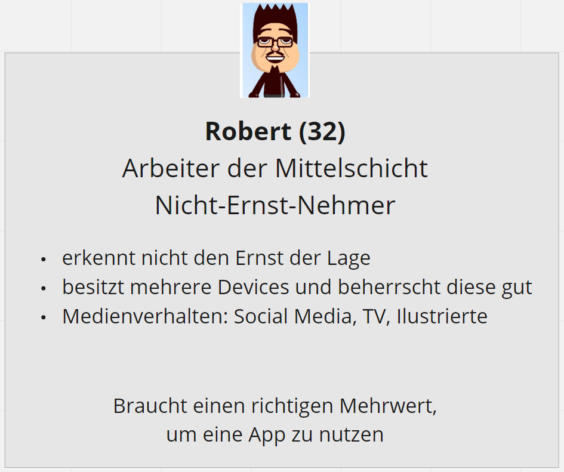
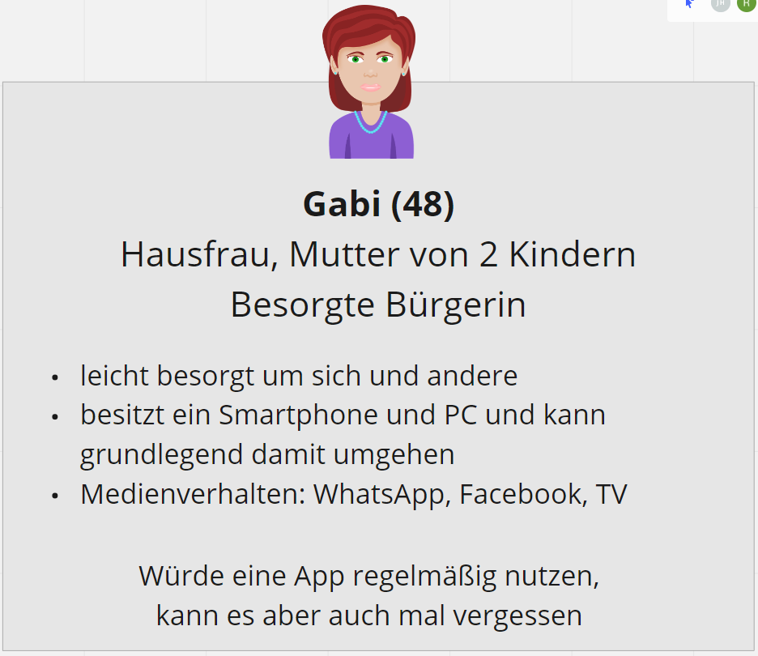
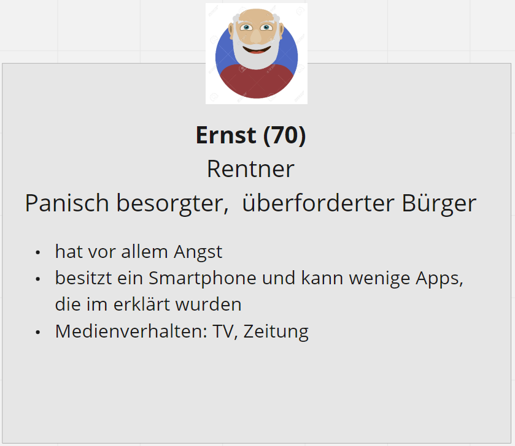
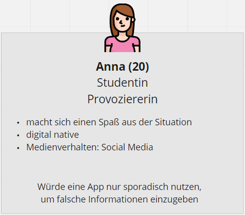

# Personas

In einem ersten Schritt wurden die Zielgruppen unserer App definiert: die allgemeine Bevölkerung, öffentliche Einrichtungen undd medizinische Einrichtungen. Es wurde sich auf die Gruppe Bevölkerung fokussiert, da diese Gruppe die App später nutzen soll. Die anderen beiden Zielgruppen benötigen die Eingabe und treten daher zunächst in den Hintergrund. Bei der Bevölkerung wurde eine weitere Unterscheidung bezüglich dem Gesundheitszustand getroffen: Gesunde Person, Person mit Vorerkrankungen aber symptomfrei und Person mit Symptomen. Hierbei waren die ersten beiden von besonderem Interesse, da diese von einer Nutzung der App überzeugt werden müssen. Aus diesem Grund wurde für diese Gruppen Peronas definiert. Insgesamt konnten vier verschiedene Personas erstellt werden. 

## Robert

Die erste Person ist Robert, 32 Jahre und Arbeiter in der Mittelschicht. Er ist derzeit gesund, hat keine Vorerkrankungen und erkennt nicht den Ernst der Lage. Er besitzt mehrere digitale Geräte und beherrscht diese gut. Er nutzt verschiedenste Medien zum Informieren und Austauschen mit anderen. Da er derzeit gesund ist und den Ernst der Lage nicht erkennt, muss eine App für ihn einen richtigen Mehrwert bieten, damit er diese nutzt. 

## Gabi

Die zweite Person ist Gabi, 48 Jahre, Hausfrau und hat zwei Kinder. Sie ist derzeit gesund, hat keine Vorerkrankungen ist aber leicht besorgt um sich und ihre Kinder. Sie besitzt ein Smartphone und einen PC und kann mit beiden grundlegend umgehen. Sie nutzt verschiedenste Medien zum Informieren und zum Austauschen, wobei sie sich hierbei auf die bekanntesten beschränkt. Sie würde eine angebotene App regelmäßig für sich und ihre Kinder nutzen. Da sie aber viel hat, kann es vorkommen, dass sie die Nutzung auch mal vergisst.

## Ernst

Die dritte Person ist Ernst, 70 Jahre und Rentner. Er ist derzeit gesund, hat aber bereits Vorerkrankungen und ist daher panisch besorgt um seine Gesundheit. Aufgrund seines hohen Alters besitzt er zwar ein Smartphone kann dies aber nur für einfache Anwendungen nutzen. Nachdem die Kinder ihm gezeigt haben, wie eine Anwendung funktioniert, kann er diese auch nutzen. Er informiert sich vorallem im öffentlich, rechtlichen Fernsehen sowie in Printmedien. Er würde, sofern er die App verstanden hat, diese mehrmals täglich nutzen, um stets sein Gewissen zu beruhigen. 

## Anna

Die letzte Person ist Anna, 20 Jahre und Studentin. Sie ist gesund und hat keine Vorerkrankungen. Spaß steht bei ihr im absoluten Fokus, sie macht sich aus allem einen Spaß und provoziert gerne. Sie gehört zur Generation digital native und informiert sich daher fast ausschließlich über Social Media. Sie würden den Sinn der App nicht verstehen und sich einen Spaß daraus machen, die App mit falschen Eingaben zu nutzen. 

